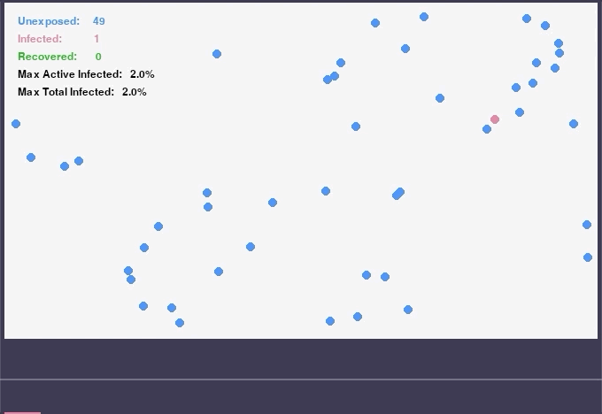
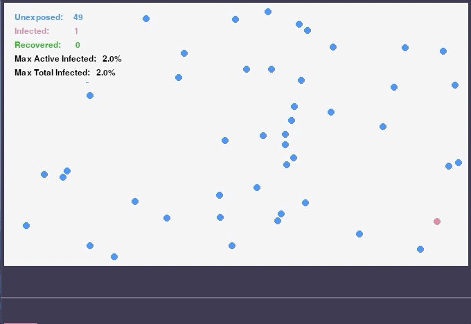

# Python Epidemic Simulation

## Summary

### This is not a scientifically correct or rigorous simulation. It is used for programming learning purposes only!

This is a crude simulation of an edpidemic using Python and `pygame`.

The simulation consists of a 2-dimensional space in which a configurable number of epidemiological hosts move and transmit a contagious state with variable linear velocity.

Each host exists in a state of `unexposed`, `infected`, or `recovered`.

## Demos

### No Preventative Measures

### Shelter In Place - Partial Adherence

### Limit Travel - Partial Adherence

### Vaccinate, Shelter - Partial Adherence, Variable Drip

## Key simulation concepts:

### Basic Laws

The following laws govern the simulation:

- When initialized, a configured percentage of adherent hosts follow preventative measures.
- Unless limited by preventative measures, hosts initialize traveling in a random direction in a specified range of speed.
- If an `unexposed` and `infected` host come into contact, the `unexposed` host becomes `infected`
- `infected` hosts, while contagious, gradually recover over time
- All hosts survive
- After a configurable period of time, an `infected` host becomes `recovered`
- `recovered` hosts are not contagious

### Preventative Measures

Several preventative measures can be simulated. A configurable percentage of the population adopting preventative measure can be chosen. Given a percentage of `PREVENTATIVE_MEASURE_ADHERENCE`, a random sample of the population is chosen to behave accordingly.

#### Shelter In Place

The `SHELTER_IN_PLACE` preventative measure sets the velocity of adhering hosts to 0 (permanent)

#### Vaccination

The `VACCINATE_POP` preventative measure provides the adhering hosts with a recovery multiplier. The vaccination for any host provides is a random value between 0 and `VACCINATION_DRIP`, which is added to the recovery constant for any host.
`VACCINATION_DRIP` is intended to simulate the idea that of the percentage of units that adhere, each vaccinates at a variable time. Vaccination effect takes place immediately, even if a host is in unexposed state.

#### Limit Travel

The `LIMIT_TRAVEL` preventative measure sets the initial velocity of adhering hosts to 50%

## Running

- Install dependencies:
    - `pip install -r requirements.txt`

- Customize parameters
    - Edit any of the provided values in `constants.py` to change boundary conditions.
    - the `PreventativeMeasure.SELECTED` array provides the active `PreventativeMeasures`
    
 ## Credits
 
Thank you to [Vue Minh Khue's example](https://github.com/khuevu/pygames/tree/master/bouncingball), from which I adapted basic 2-dimensional particle interactions for simulating collisions between circular objects in `pygame`.

 ## Improvements
 
 Improvements, additions, and corrections to the simulation are welcome. Please create a pull request if you would like to contribue.
